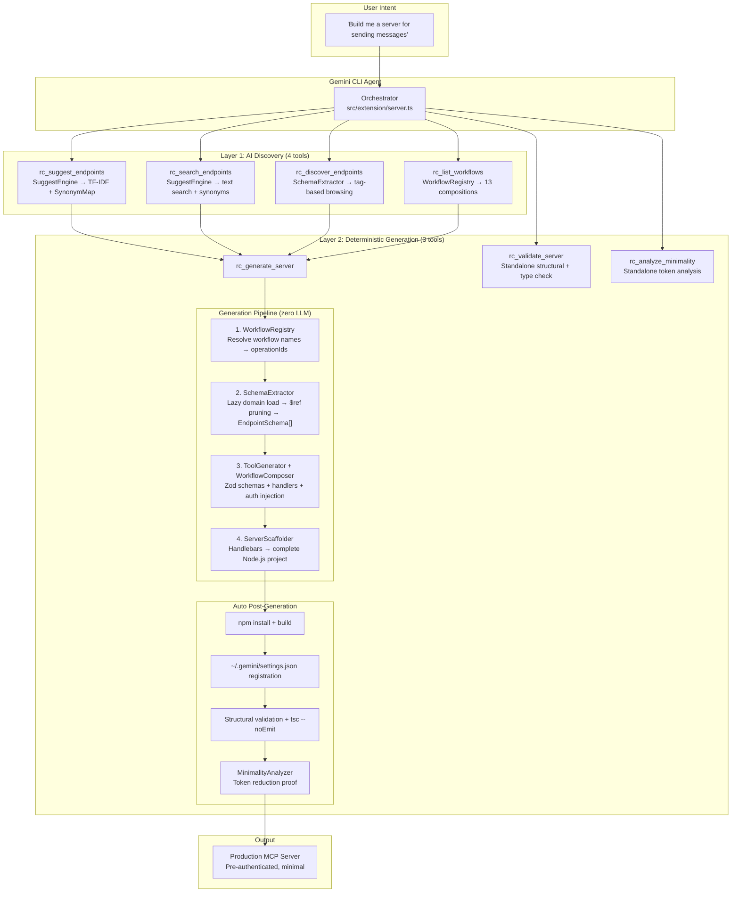

# Minimal MCP Server Generator for Rocket.Chat

> **GSoC 2026 · Rocket.Chat · Mentor(s): Hardik Bhatia, Dhairyashil Shinde**

## The Problem You Already Know

If you've built an MCP server, you've hit this wall:

You register tools for an LLM agent. Each tool carries its name, description, and full JSON Schema parameters — all serialized into the context window on every single prompt. For a platform like Rocket.Chat with **547 REST API endpoints** across 12 OpenAPI specs, that's **~115,200 tokens** injected before the model even starts reasoning.

In agentic loops, this cost compounds: `O(N × T)` — where `N` is iterations and `T` is token waste per iteration. Five agentic runs on Gemini 2.0 Flash's free tier? Budget gone. The model hasn't even written useful code yet.

But the waste isn't just financial. It's structural:

| What breaks | Why |
|---|---|
| **Token Burning** | Agents in loops pay ~115K tokens **per iteration** on static tool definitions. 100 iterations/day = 11.5M tokens burned — most of it on APIs the project will never use. On free-tier plans, budget exhausts in ~5 runs |
| **Tool Confusion & Hallucination** | 547 tools with near-identical prefixes (`channels.list` vs `channels.list.joined` vs `channels.online`) cause the model to invoke the wrong endpoint. This triggers cascade failures: wrong tool → bad response → retry with another wrong tool → each retry re-pays the full 115K context cost |
| **Reasoning Degradation** | Static JSON Schema bloat consumes the context window, leaving less room for Chain-of-Thought reasoning, degrading output quality, and increasing response latency |
| **Cost scalability** | Every agent iteration re-pays the full 115K token tax, making MCP adoption economically unviable for open-source projects on free-tier plans |

This is the "context bloat" problem. Every current MCP server has it. Most teams work around it. We fix it at the root.

---

## What This Project Does

`rc-mcp` generates **standalone, minimal MCP servers** containing only the 2–12 Rocket.Chat API endpoints your agent actually needs. The generated server is a complete, independent Node.js project — not a filtered view of a monolith.

```
Before:  LLM ──→ Full MCP Server (547 tools, ~115K tokens) ──→ tool confusion, token waste
After:   LLM ──→ Minimal MCP Server (2-12 tools, ~795 tokens) ──→ correct tool use, 99.7% savings
```

The generation pipeline uses **zero LLM calls**. Same `operationIds` in → same server out. Every time, deterministically.

### The Result

| Metric | Full Server | Generated Minimal Server | Reduction |
|---|:---:|:---:|:---:|
| Endpoints | 547 | 2 | **99.6%** |
| Schema payload | 2.2 MB | 3.1 KB | **99.9%** |
| JSON Schema components | 138 | 3 | **97.8%** |
| Average Token footprint | ~115,201 | ~795 | **99.7%** |

These numbers are not estimates. They're computed by the built-in `rc_analyze_minimality` tool and are reproducible on every run.

---

<div align="center">
  <a href="https://youtu.be/kqjsCxgBl5A">
    
  </a>
  <p><em>▶ Watch the end-to-end demo: natural language → generated server → validated & proven minimal</em></p>
</div>

---

## Architecture

The system has two layers. AI handles discovery. Code generation is entirely deterministic.



**Why two layers?** AI is useful for figuring out *which* endpoints to include. It has no place in the code generation itself. Mixing LLM inference into scaffolding introduces non-determinism, token cost, and hallucination risk — exactly the problems we're solving.

### Layer 1: AI Discovery — 4 Tools

The developer describes what they want in plain English. The Gemini CLI agent uses four discovery tools to identify the right `operationIds` and `workflows`:

| Tool | What it does | How it works internally |
|---|---|---|
| `rc_suggest_endpoints` | Maps vague intent → multiple API clusters in one call | V4 `SuggestEngine` (`suggest-engine.ts`, 567 lines): offline weighted keyword scoring (TF-IDF), 82-entry synonym expansion via `synonym-map.ts`, intelligent clustering to ensure a diverse set of tools (set-cover algorithm), and guaranteed domain coverage. |
| `rc_search_endpoints` | Keyword search across all 547 endpoints | Same synonym expansion + TF-IDF scoring engine, returns flat ranked results instead of clusters |
| `rc_discover_endpoints` | Browsable tag summaries → expand specific tags on demand | `SchemaExtractor.getEndpointsByTag()` — groups by `Domain → Tag → EndpointSchema[]`. First call returns summaries (~100 lines); expansion reveals individual endpoints. Prevents context blowout during exploration |
| `rc_list_workflows` | List 13 predefined workflow compositions | `WorkflowRegistry.getWorkflows()` — returns composed tools that combine multiple RC API endpoints into single, higher-level operations (e.g. `send_message_to_channel`). |

### Layer 2: Deterministic Pipeline — 3 Tools

Once the agent has selected `operationIds` and/or `workflows`, the pipeline executes with zero LLM involvement:

**`rc_generate_server`** orchestrates the Core Engine components, followed by automated post-generation steps:

| Component | File | What it does |
|---|---|---|
| **Workflow Registry** | `workflow-registry.ts` | Resolves requested workflow names into exact API operation paths (`WorkflowDefinition`s) prior to schema extraction. |
| **Schema Extractor** | `schema-extractor.ts` (486 lines) | Fetches and fully dereferences the 12 Rocket.Chat OpenAPI YAML specs using `@apidevtools/swagger-parser`. Supports **lazy domain loading** via `inferDomainsFromIds()` — scans cached JSON strings to determine which 2-3 domains out of 12 need loading, bypassing unnecessary network overhead. Resolves all nested `$ref` chains. Handles `oneOf`/`anyOf` by merging variants into flat structures. |
| **Tool Generator** | `tool-generator.ts` & `workflow-composer.ts` | Transforms `EndpointSchema[]` → `GeneratedTool[]`. Auto-injects `authToken` + `userId` into Zod schemas. Uses its internal `WorkflowComposer` sub-engine to generate composite tools via AST mapping, chaining multiple endpoints into single platform operations. |
| **Server Scaffolder** | `server-scaffolder.ts` (674 lines) | Assembles a complete Node.js project using 9 Handlebars inline templates. Output: `src/server.ts`, `src/tools/*.ts`, `src/rc-client.ts`, `tests/*.test.ts`, `package.json`, `tsconfig.json`, `.env.example`, `README.md`. |

**Automated post-generation** (all performed by `rc_generate_server` in a single call):

| Step | What it does |
|---|---|
| **`.env` creation** | Writes a real `.env` with provided `rcUrl`, `rcAuthToken`, `rcUserId` so the server is pre-authenticated on first run |
| **`npm install` + `npm run build`** | Installs dependencies and compiles TypeScript (skippable via `installDeps: false`) |
| **Gemini CLI registration** | Auto-updates `~/.gemini/settings.json` with the new server's MCP entry, so tools are immediately available after restarting gemini (skippable via `registerWithGemini: false`) |
| **Inline validation** | Checks all required files exist + runs `tsc --noEmit` for type safety |
| **Minimality analysis** | Computes 4-dimension pruning report inline — no separate tool call needed |

**`rc_validate_server`** audits the generated output across 4 categories:

| Check | What passes |
|---|---|
| Structure | `package.json`, `tsconfig.json`, `src/server.ts`, `src/rc-client.ts`, `.env.example` exist |
| MCP compliance | `@modelcontextprotocol/sdk` and `zod` in dependencies |
| Tool coverage | Every `src/tools/*.ts` contains `z.object()`; every tool has a matching `tests/*.test.ts` |
| Deep type safety | `npx tsc --noEmit` inside the generated project — zero TypeScript compilation errors |

**`rc_analyze_minimality`** computes a 4-dimension pruning report: endpoint count reduction, schema payload reduction, component count reduction, and estimated token savings. Uses `$ref` resolution depth tracking (recursive to 15 levels) and a 4 chars/token estimation heuristic.

---

## The V4 Suggest Engine — How Intent Maps to Endpoints

When a developer says *"build a customer support bot"*, the engine needs to find the right APIs across messaging, omnichannel, and user management — without any LLM call.

The `SuggestEngine` class (`src/core/suggest-engine.ts`, 567 lines) powers the `rc_suggest_endpoints` tool. It operates entirely offline, generating highly specialized clusters that are passed directly back to the native Gemini CLI agent to orchestrate:

### Phase 1: Semantic Scoring & Clustering (The Engine)

**Step 1: Tokenization & Synonym Expansion**
```
Input:     "create project channel, invite members, send task updates"
Tokenized: ["creat", "project", "channel", "invit", "member", "send", "task", "updat"]
Expanded:  ["creat", "project", "channel", "invit", "member", ..., "add", "join", "post", "chat", ...]
```

Uses a custom minimal Porter stemmer + 48-word stop set. The synonym map (`synonym-map.ts`, 82 entries) bridges user vocabulary to API vocabulary: `"invite"` → `["invite", "add", "join", "member"]`, `"star"` → `["star", "starmessage", "starred", "bookmark", "favorite"]`.

**Step 2: TF-IDF Scoring with Field Weights**

Every token is scored against all 547 endpoints. The field the token appears in determines its weight:

| Field | Weight | Why |
|---|:---:|---|
| `operationId` | **10×** | Most precise API identifier |
| `path` | **5×** | Structured endpoint name |
| `tags` | **3×** | Semantic domain grouping |
| `summary` | **2×** | Concise OpenAPI description |
| `description` | **0.1×** | Verbose boilerplate — nearly ignored to prevent false matches |

```
score = Σ [ IDF(token) × directWeight × fieldWeight ]

  IDF(token) = log(N / df(token))        — N = 547 endpoints, df = document frequency
  directWeight = 3 if original intent token, 1 if synonym-only
  fieldWeight = max weight across all fields containing the token
```

**Step 3: Cluster Grouping**

Endpoints are grouped by `domain::tag`. Within each cluster:
- Endpoints scoring <50% of the cluster's top scorer are dropped (noise filtering)
- Maximum 5 endpoints per cluster
- Only `fieldWeight ≥ 2` matches count toward coverage (prevents description-text false positives)

**Step 4: Greedy Set-Cover Selection**

```
while remaining_clusters > 0 and selected < 5:
    for each candidate:
        new_coverage = uncovered intent tokens this cluster would cover
        penalty = 0.5 if this domain already selected, else 1.0
        score = new_coverage × penalty
    select highest-scoring cluster
    break if full coverage achieved
```

**Step 5: Domain Coverage Guarantee**

If the intent explicitly mentions a domain (detected via `DOMAIN_HINTS`, ~60 keyword→domain mappings), the engine force-adds that domain's best cluster — even if the greedy algorithm didn't select it.

**Step 6: Confidence**

```
coverage = |covered_original_tokens| / |intent_tokens|
confidence = coverage ≥ 0.5 → "high" | ≥ 0.25 → "medium" | else → "low"
```

### Phase 2: Native Agent Orchestration (The Brain)

Once the `SuggestEngine` computes the optimal endpoint clusters, the **built-in models inside Gemini CLI** act as the "Brain." There is no need for an external `GEMINI_API_KEY` or custom outbound API calls. The native Gemini agent inspects the TF-IDF results, communicates the options to the user, and autonomously invokes the `rc_generate_server` pipeline.

---

## How Context Reduction Actually Works

Seven specific techniques, each targeting a different source of token waste:

### 1. Surgical `$ref` Pruning
`SchemaExtractor` uses `@apidevtools/swagger-parser` to fully dereference all `$ref` chains. Lazy domain loading via `inferDomainsFromIds()` scans cached JSON strings to determine which 2-3 domains (out of 12) actually need loading. The engine prunes 2.2 MB → 3.1 KB.

### 2. Description Compression (≤120 chars)
`ToolGenerator` enforces `MAX_DESC_LENGTH = 120`, stripping OpenAPI boilerplate:
```ts
desc.replace(/\s*\(requires authentication\)/gi, "")
    .replace(/\s*\(admin only\)/gi, "")
    .replace(/\s*Permission required:.*$/gi, "")
```

### 3. Per-Request Auth Injection
For `requiresAuth` endpoints, `ToolGenerator` prepends two Zod fields instead of requiring a login tool:
```ts
authToken: z.string().describe("Rocket.Chat Auth Token (X-Auth-Token)")
userId: z.string().describe("Rocket.Chat User ID (X-User-Id)")
```
The handler calls `rcClient.setAuth(params.authToken, params.userId)` before each request. Collision-safe: if the endpoint itself has fields named `authToken` or `userId`, the injected fields are prefixed with `_rc`.

### 4. Progressive Disclosure
`rc_discover_endpoints` returns tag summaries first (~100 lines), not the full endpoint list (~10,000 lines). The agent expands only relevant tags via `expand: ["tagName"]`.

### 5. Multi-Cluster Semantic Mapping
One call to `rc_suggest_endpoints` returns cross-domain clusters covering all parts of the intent. No iterative prompt engineering needed.

### 6. 2-Tier Caching
```
Tier 1: Disk (.cache/ — 24h TTL, stored as dereferenced JSON)
  ↓ miss
Tier 2: GitHub raw fetch (SwaggerParser.dereference(url))
```
After first run, all operations use the disk cache. Generation completes in milliseconds.

### 7. Zero-LLM Pipeline
`SchemaExtractor` → `ToolGenerator` → `ServerScaffolder` uses zero API calls. Deterministic, free, and fast.

---

## Quick Start

### Install & Link

```bash
git clone https://github.com/thekishandev/MCP-Server-Generator.git
cd MCP-Server-Generator
npm install && npm run build

# Register as a Gemini CLI extension
gemini extensions link .
```

### Generate a Server (Agentic Workflow)

```bash
gemini
```

> *"Generate MCP server for team collaboration that sends direct messages, creates discussion threads, reacts to messages with emoji and pins important announcements."*

The Gemini agent will:
1. Call `rc_suggest_endpoints` → receive multi-cluster suggestions
2. Confirm the endpoint list with you
3. Call `rc_generate_server` → write files, install deps, build, register with Gemini CLI, validate, and run minimality analysis — **all in one call**
4. Output a ready-to-use server — just restart `gemini` and the new tools are available

### Generate a Server (Direct CLI — No LLM)

```bash
rc-mcp suggest "send messages and manage channels" --generate -o ./my-server
rc-mcp validate ./my-server --deep
rc-mcp analyze --endpoints post-api-v1-chat-sendMessage,post-api-v1-channels-create
```

---

## MCP Tools Reference

6 tools registered via `@modelcontextprotocol/sdk` using `StdioServerTransport`:

| Tool | Purpose | Parameters |
|---|---|---|
| `rc_suggest_endpoints` | Intent → multi-cluster API suggestions | `intent: string` |
| `rc_search_endpoints` | Keyword search across 547 endpoints | `query: string`, `domains?: Domain[]`, `limit?: number` |
| `rc_discover_endpoints` | Tag summaries → expandable endpoint lists | `domains: Domain[]`, `expand?: string[]` |
| `rc_list_workflows`      | List 13 predefined composite workflows | `{}` |
| `rc_generate_server` | Scaffold, install, build, register, validate — all-in-one | `operationIds?: string[]`, `workflows?: string[]`, `outputDir: string`, `serverName?`, `rcUrl?`, `rcAuthToken?`, `rcUserId?`, `installDeps?`, `registerWithGemini?` |
| `rc_analyze_minimality` | 4-dimension pruning proof | `operationIds: string[]` |
| `rc_validate_server` | Structure + MCP + Zod + `tsc` validation | `serverDir: string`, `deep?: boolean` |

**`rc_generate_server` auto-performs** (saves 2+ round-trip tool calls):
- ✅ Writes `.env` with provided credentials (pre-authenticated on first run)
- ✅ `npm install` + `npm run build`
- ✅ Registers in `~/.gemini/settings.json` (restart gemini to use new tools)
- ✅ Structural validation + `tsc --noEmit` type check
- ✅ 4-dimension minimality analysis

**12 Supported Domains:** `authentication` · `messaging` · `rooms` · `user-management` · `omnichannel` · `integrations` · `settings` · `statistics` · `notifications` · `content-management` · `marketplace-apps` · `miscellaneous`

---

## Validation & Testing

### 96 Tests (91 Passing, 5 Skipped) · 0 TypeScript Errors

```bash
npm test
```

| Suite | What it validates |
|---|---|
| `suggest-engine.test.ts` | TF-IDF scoring accuracy, synonym expansion, cluster grouping, deduplication, search results |
| `tool-generator.test.ts` | Zod codegen correctness, auth injection, description compression, handler generation |
| `server-scaffolder.test.ts` | Template rendering, file output structure, `package.json` integrity |
| `schema-extractor.test.ts` | Domain loading, endpoint indexing, fuzzy matching |
| `minimality-analyzer.test.ts` | Reduction calculations, `$ref` depth analysis, report formatting |
| `workflow-*.test.ts` | 39 tests proving the Zod generation and handler resolution of 13 composite workflows |
| `extension-server.test.ts` | MCP tool registration, server export verification |
| 30+ generated tool tests | Dynamic Zod `safeParse` validation, shape introspection, type rejection |

### Generated Test Intelligence

Test files are not `expect(true)` stubs. Each generated test:
1. Asserts the schema is a `z.ZodObject` instance
2. Inspects `.shape` to identify required fields
3. Verifies `safeParse({})` fails when required fields exist
4. Rejects invalid data types (`string` where `object` expected)

---

## Gemini CLI Extension Integration

Built following [Gemini CLI Extension Best Practices](https://geminicli.com/docs/extensions/best-practices/):

| Practice | Implementation |
|---|---|
| Secure secrets | `gemini-extension.json` marks `RC_PASSWORD` with `sensitive: true` → OS keychain storage |
| Contextual docs | Auto-generates `GEMINI.md` documenting available tools, parameters, auth requirements |
| TypeScript build | Full TypeScript project → `tsc` → `dist/` JavaScript output |
| Minimal permissions | Only 2-12 tools exposed → agent physically cannot invoke unrelated APIs |
| Gallery-ready | `gemini-extension.json` at repo root → `gemini extensions install <url>` |
| Local dev | `gemini extensions link .` for instant iteration |
| Auto-registration | `rc_generate_server` auto-updates `~/.gemini/settings.json` — no manual config needed |

---

## Project Structure

```
MCP-Server-Generator/
├── src/
│   ├── cli/
│   │   └── index.ts                    # Commander.js CLI entry point (823 lines)
│   ├── core/
│   │   ├── types.ts                    # 13 shared TypeScript interfaces (168 lines)
│   │   ├── schema-extractor.ts         # OpenAPI parser + lazy domain loading + 2-tier cache (486 lines)
│   │   ├── tool-generator.ts           # JSON Schema → Zod codegen (383 lines)
│   │   ├── server-scaffolder.ts        # 9 Handlebars templates (674 lines)
│   │   ├── suggest-engine.ts           # V4 TF-IDF engine (567 lines)
│   │   ├── synonym-map.ts             # 82 synonyms + 60 domain hints
│   │   ├── minimality-analyzer.ts      # 4-dimension analysis (679 lines)
│   │   ├── gemini-integration.ts       # Extension manifest generator (271 lines)
│   │   └── index.ts                    # Barrel export
│   └── extension/
│       └── server.ts                   # Live 6-tool MCP server (597 lines)
├── tests/                              # 11 test files, 96 tests
├── .cache/                             # Dereferenced OpenAPI JSON (24h TTL)
├── gemini-extension.json               # Extension manifest (v0.2.0)
├── GEMINI.md                           # LLM context instructions
└── package.json                        # rc-mcp v0.1.0
```

---

## Technical Stack

| Layer | Technology | Version |
|---|---|---|
| Language | TypeScript (strict, ES2022, NodeNext) | ^5.7.0 |
| Runtime | Node.js | ≥18.0.0 |
| CLI | Commander.js | ^12.1.0 |
| OpenAPI Parser | `@apidevtools/swagger-parser` | ^12.1.0 |
| Templates | Handlebars | ^4.7.8 |
| Schema Validation | Zod | ^3.25.76 |
| MCP SDK | `@modelcontextprotocol/sdk` | ^1.27.1 |
| Testing | Vitest | ^4.0.18 |
| YAML | yaml | ^2.6.1 |
| Terminal UX | Chalk + Ora | ^5.3.0 / ^8.1.1 |

---

## License

MIT — A GSoC 2026 project with [Rocket.Chat](https://rocket.chat)
