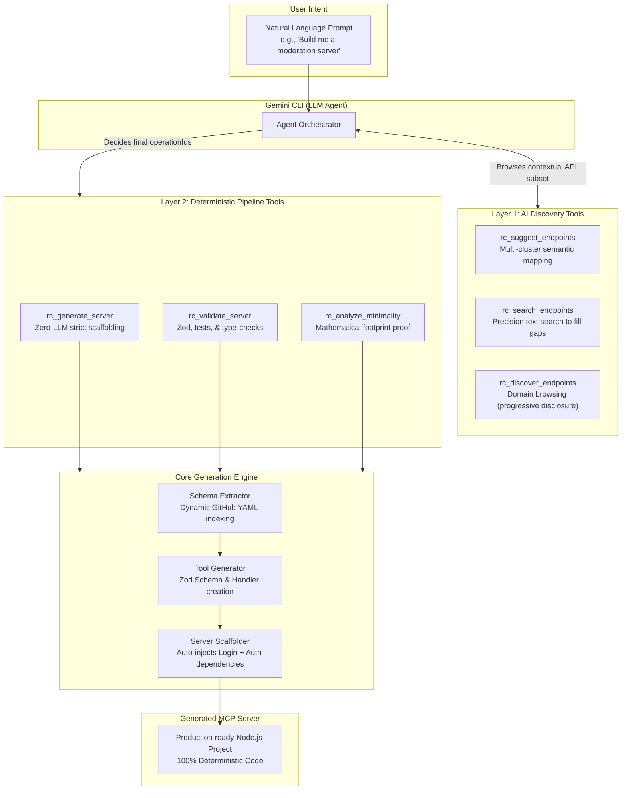

# 🚀 Minimal MCP Server Generator for Rocket.Chat

**Generate production-ready, minimal MCP servers with only the Rocket.Chat APIs you need.**

Solves the #1 structural problem with Model Context Protocol (MCP) adoption: **Context Bloat**. Instead of loading 500+ API tools into your LLM's context window, generate a surgically precise server with just 2–12 tools — achieving **99%+ context reduction** and lowering inference costs.

- ⚡ **Deterministic generation** — zero LLM calls in the generation pipeline.
- 🧠 **AI-powered discovery** (`suggest`) — maps natural language intent → capability via Gemini or fully offline keyword fallback.
- 📉 **Surgical extraction** — 97–99% reduction in endpoints, schema size, and token overhead.
- 🏛️ **Dual-Layer Architecture** — distinct separation between AI reasoning and strict code generation.
- 🧪 **Professional maturity** — rigorous "Definition of Done", passing unit tests, zero TypeScript errors.
- 🧩 **`gemini-cli` Best Practices** — auto-generates `.gemini-extension`, `GEMINI.md`, and secures credentials using `sensitive: true` settings.

---

**Watch the Demo Video:**

<div align="center">
  <a href="https://youtu.be/kqjsCxgBl5A">
    
  </a>
</div>

---

## 🛑 The Core Problem: Context Bloat

When adopting MCP, agents interact with external services via tools. However, most MCP servers expose the **entire API surface** of a platform.

For Rocket.Chat, this means feeding the full API spectrum into every single LLM prompt:

| Dimension  | Full Server | With `rc-mcp` (e.g., Send Message) | Reduction |
| ---------- | :---------: | :--------------------------------: | :-------: |
| Endpoints  |     558     |                 2                  | **99.6%** |
| Schema     |   2.2 MB    |               3.1 KB               | **99.9%** |
| Components |     138     |                 3                  | **97.8%** |
| Tokens     |  ~184,000   |                ~661                | **99.6%** |

### Why is this bad?

- **Token Burning:** Agents operating loops pay that massive token cost on every single iteration, draining free-tiers and budgets.
- **Tool Confusion & Hallucination:** Models confronted with hundreds of similar tools (e.g., `channels.list` vs `channels.list.joined`) frequently invoke the wrong one.
- **Slower Reasoning:** Bloated context limits reasoning space and decelerates model response times.

### The Solution

We flip the model. **MCP servers should be minimal by construction.** Rather than pruning unused endpoints at runtime, `rc-mcp` generates an entirely fresh, independent MCP Node.js project containing exactly and only the APIs required for your requested capability. Minimality is deterministic, mathematical, and provable.

---

## 🏛️ Dual-Layer Architecture




The system is strictly divided to ensure safety, predictability, and usability. **AI belongs exclusively at the orchestration and discovery layer**, while the infrastructure layer (the actual code generation) remains **100% deterministic**.

### Layer 1: AI Discovery (The Context Savers)

Developers don't need to know exact `operationIds`. They describe their intent in plain English to the Gemini CLI agent, which uses 3 distinct lookup tools:

- **`rc_suggest` (Primary):** The starting point. It maps a single natural language intent to **multiple** highly relevant API clusters across different domains simultaneously. Powered by our V4 engine's semantic mapping and strict domain guarantees.
- **`rc_search` (Gap Filler):** If the initial suggestion missed a specific corner case, the agent searches the entire 558-endpoint index via keywords to pinpoint exact operations.
- **`rc_discover` (Open Exploration):** If the user is just browsing, this tool implements progressive disclosure. The agent reads high-level tag summaries, and only expands the tags it finds relevant, preventing monolithic context bloat.

### Layer 2: Deterministic Generation & QA

Once the agent knows exactly which `operationIds` it needs, it hands off to the deterministic tools. There is zero LLM intervention in writing the server code:

1. **`SchemaExtractor`**: Surgically parses the 12 official OpenAPI YAML files directly from GitHub. It extracts _only_ the demanded endpoints and deeply resolves the recursive `$ref` dependency tree (up to depth 10) for required data models. It aggressively caches results locally in `.cache/` for 24 hours to ensure speed.
2. **`ToolGenerator`**: Transforms OpenAPI JSON shapes into TypeScript Zod schema definitions and executable MCP tool handler functions. Compresses tool descriptions to ≤120 characters to prevent verbose API descriptions from hijacking the context window.
3. **`ServerScaffolder`**: Assembles a complete, runnable Node.js project. **It automatically injects the basic authentication (`login`) endpoint if any requested tools require auth**, scaffolding `server.ts`, tools, configurations, and intelligent dynamic `vitest` stubs.
4. **`Validator` & `Analyzer`**: The agent proves its work. It runs the structural validations and generates a mathematical footprint report, guaranteeing the user gets a working, minimal output.

---

## 🧠 V4 AI Suggest Engine Improvements

The `rc_suggest_endpoints` tool is powered by a custom-built, heavily optimized semantic search engine explicitly designed to bridge natural language intent to API vocabulary. In **v4**, we implemented several advanced algorithms to achieve pristine endpoint clustering without noise:

- **Semantic Synonym Mapping:** Users say `"monitor"`, `"transfer"`, or `"assign"`. The engine bridges these terms to `"statistics"`, `"forward"`, and `"role"` to reliably hit exact API domains, even when vernacular doesn't perfectly match Rocket.Chat's internal identifiers.
- **Dynamic Domain Coverage Guarantee:** When the user explicitly asks for a distinct feature (e.g., `"statistics"`), the engine guarantees representation of that capability mathematically, preventing dominant clusters (like `"chat"`) from starving smaller, but requested, functional areas.
- **Strict Field-Weighted Set-Cover Algorithm:** Bloated endpoint `descriptions` cannot steal coverage away from precise `operationId` matches. The engine implements greedy set-cover picking using a strict `fieldWeight >= 2` rule (meaning only actual tags, IDs, summaries, and paths count towards intent coverage).
- **Per-Cluster Noise Filtering:** Endpoints that only weakly match the user's intent are dynamically discarded if they score `< 50%` compared to the strongest endpoint in their cluster, entirely eliminating "tag-alongs" (e.g., preventing `rooms.delete` from contaminating a request for creating discussions).

---

## ✔️ Redefining the "Definition of Done"

Generated code isn't finished until it is tested and structurally sound. The `rc-mcp` generator holds its output to rigorous professional standards.

### Deep Validation Protocol (`rc_validate_server --deep`)

Upgraded from basic structural checks to **20 precise validations**:

- Verifies exact `zod` schema imports and exports natively for every generated tool (`Tool Coverage`).
- Asserts strict Model Context Protocol connection syntax inside `server.ts`.
- Ensures test file existence maps exactly 1:1 with generated tools (`Test Coverage`).
- Executes `npx tsc --noEmit` inside the generated project, strictly failing on any TypeScript errors (`Deep Type Safety`).

### Dynamic Scaffolding & Intelligent Tests

The generator does not just create empty placeholder tests (`expect(true)`). It scaffolds intelligent Vitest suites that dynamically inspect the generated Zod schema signatures (`instanceof z.ZodObject`). The tests automatically verify structure validation, type safety mismatches, and failures on missing required parameters out of the box.

---

## 💎 gemini-cli Best Practices

`rc-mcp` is designed fundamentally around the official [Gemini CLI Extension Best Practices](https://geminicli.com/docs/extensions/best-practices/):

1. **Secure Sensitive Settings**: Auto-generates the `settings` manifest array to securely prompt for `RC_USER` and `RC_PASSWORD`, securely marking passwords with `sensitive: true` so they are stored in the host OS keychain.
2. **Effective `GEMINI.md`**: Auto-generates an insightful contextual `GEMINI.md` file tailored directly to the extracted operations, instructing the LLM on exactly how to use the specific Rocket.Chat tools provided.
3. **TypeScript & Bundling**: Scaffolds a full TypeScript project containing pre-configured build steps to output JavaScript safely for the extension engine.
4. **Minimal Permissions**: By shrinking to the exact toolset required, it intrinsically guards against over-permissioning the model (e.g., preventing a send-message agent from being able to delete users).
5. **Gallery & Git Release Ready**: The generator outputs a repository-ready structure with `gemini-extension.json` at the absolute root. You can publish your generated server directly to GitHub, allowing instantly installable extensions via `gemini extensions install <your-repo-url>`.
6. **Local Iteration**: Easily iterate on your generated server using the `gemini extensions link .` command in the output directory.

---

## ⚡ Quick Start (Agentic Workflow)

The primary way to use `rc-mcp` is **natively inside the `gemini-cli`** as an MCP extension. The agent orchestrates the discovery, generation, and validation for you.

### 1. Installation & Linking

```bash
# Clone and build the project
git clone https://github.com/thekishandev/MCP-Server-Generator.git
cd MCP-Server-Generator
npm install && npm run build

# Link the generator to Gemini CLI
gemini extensions link .
```

### 2. Enter the Gemini CLI

```bash
gemini
```

### 3. Generate via Natural Language

Instruct the agent to build your server using plain English:

> _"Use the Rocket.Chat tools to discover endpoints for managing channel members and kicking users, then generate an MCP server for them. Finally, run deep validation on the output."_

The Gemini agent will autonomously call the discovery tools, recommend the exact `operationIds`, cleanly scaffold the Node.js project, and run the minimality/validation reports—all within the chat interface!

---

## 🛠️ MCP Tools Reference (For the LLM Agent)

When linked to an LLM, the generator exposes these 6 native MCP tools:

| Tool Name               | Purpose for the Agent                                                  |
| :---------------------- | :--------------------------------------------------------------------- |
| `rc_suggest_endpoints`  | Maps the human's vague intent to multiple API clusters via V4 Engine.  |
| `rc_search_endpoints`   | Full-text index search to pinpoint exact operations or fill gaps.      |
| `rc_discover_endpoints` | Browses the 558-endpoint API via progressive disclosure (tags first).  |
| `rc_generate_server`    | Scaffolds the complete Node.js server project to disk.                 |
| `rc_analyze_minimality` | Provides mathematical proof of token/schema reduction vs the full API. |
| `rc_validate_server`    | Runs structural, type-safety (`--deep`), and test coverage checks.     |

---

## 💻 Standalone CLI Reference (Under the Hood)

You can also bypass the LLM entirely and run the deterministic pipeline directly from your terminal:

| Command                     | Purpose                                                                  | Key Flags / Options                                                          |
| --------------------------- | ------------------------------------------------------------------------ | ---------------------------------------------------------------------------- |
| `rc-mcp suggest "<intent>"` | Maps natural language to endpoints (AI / Keyword fallback).              | `--top <n>`, `--json`, `--generate`, `--gemini`, `-o <dir>`, `--rc-url`      |
| `rc-mcp analyze`            | Deep minimality reporting (pruning metrics, token estimation).           | `--endpoints <p1,p2>`, `--json`                                              |
| `rc-mcp generate`           | Generates the complete minimalistic Node.js server project.              | `--endpoints <p1,p2>`, `--gemini`, `-o <dir>`, `--rc-url`, `--name <string>` |
| `rc-mcp validate <dir>`     | Runs structural and architectural compliance checks on output.           | `--deep` (Executes TS compilation checks inside output directory)            |
| `rc-mcp integrate <dir>`    | Retroactively injects `gemini-cli` integration into established outputs. | `--mode <extension\|config>`                                                 |

---

## 🎯 Testing & E2E Demo

### 134 Tests & Deep Coverage

The core codebase and its generated outputs are rigorously tested.

```bash
# Run all vitest suites with 0 TypeScript errors
npm test
```

_Suites map directly to core architecture (`suggest-engine.test.ts`, `server-scaffolder.test.ts`, `schema-extractor.test.ts`, etc.), and the environment dynamically sweeps through over 30 generated tool test files to ensure Zod/Type safety at scale._

### End-To-End Agentic Demo

We provide a comprehensive step-by-step master script for demonstrating the full capability of the project natively inside the Gemini CLI.

Please refer to the [DEMO_GUIDE.md](./DEMO_GUIDE.md) in the project root to walk through AI Discovery, Progressive Disclosure, Deterministic Generation, and rigorous Definition of Done validation.

---

## 🛠️ Technical Stack & Dependencies

- **Language:** TypeScript (Strict Mode execution)
- **Runtime:** Node.js 18+
- **CLI Framework:** Commander.js
- **Templating:** Handlebars
- **Schema Safety:** Zod
- **Integration:** `@modelcontextprotocol/sdk`
- **AI Gateway:** `@google/generative-ai` (Gemini API `v1`)
- **Testing Engine:** Vitest

---

## License

MIT
</br> (A project tailored for Google Summer of Code with Rocket.Chat)
