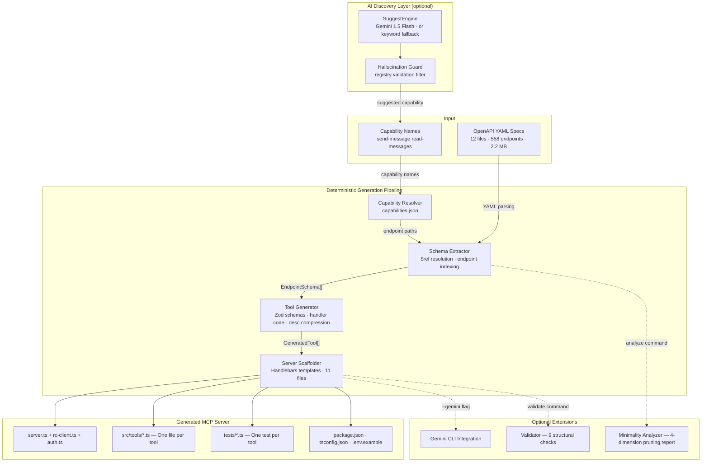

# 🚀 Minimal MCP Server Generator for Rocket.Chat

**Generate production-ready, minimal MCP servers with only the Rocket.Chat APIs you need.**

Solves the #1 structural problem with Model Context Protocol (MCP) adoption: **Context Bloat**. Instead of loading 500+ API tools into your LLM's context window, generate a surgically precise server with just 2–12 tools — achieving **99%+ context reduction** and lowering inference costs.

- ⚡ **Deterministic generation** — zero LLM calls in the generation pipeline.
- 🧠 **AI-powered discovery** (`suggest`) — maps natural language intent → capability via Gemini or fully offline keyword fallback.
- 📉 **Surgical extraction** — 97–99% reduction in endpoints, schema size, and token overhead.
- 🏛️ **Dual-Layer Architecture** — distinct separation between AI reasoning and strict code generation.
- 🧪 **Professional maturity** — rigorous "Definition of Done", 49 unit tests passing, zero TypeScript errors.
- 🧩 **gemini-cli ready** — auto-generates `.gemini-extension` and `settings.json` integration.

---

**Watch the Demo Video:**
<div align="center">
  <a href="https://youtu.be/kqjsCxgBl5A">
    
  </a>
</div>

--- 

## 🛑 The Core Problem: Context Bloat

When adopting MCP, agents interact with external services via tools. However, most MCP servers expose the **entire API surface** of a platform.

For Rocket.Chat, this means feeding the full API spectrum into every single LLM prompt:

| Dimension | Full Server | With `rc-mcp` (e.g., Send Message) | Reduction |
|-----------|:-----------:|:---------------------------------:|:---------:|
| Endpoints | 558         | 2                                 | **99.6%**   |
| Schema    | 2.2 MB      | 3.1 KB                            | **99.9%**   |
| Components| 138         | 3                                 | **97.8%**   |
| Tokens    | ~184,000    | ~661                              | **99.6%**   |

### Why is this bad?
- **Token Burning:** Agents operating loops pay that massive token cost on every single iteration, draining free-tiers and budgets.
- **Tool Confusion & Hallucination:** Models confronted with hundreds of similar tools (e.g., `channels.list` vs `channels.list.joined`) frequently invoke the wrong one.
- **Slower Reasoning:** Bloated context limits reasoning space and decelerates model response times.

### The Solution
We flip the model. **MCP servers should be minimal by construction.** Rather than pruning unused endpoints at runtime, `rc-mcp` generates an entirely fresh, independent MCP Node.js project containing exactly and only the APIs required for your requested capability. Minimality is deterministic, mathematical, and provable.

---

## 🏛️ Dual-Layer Architecture

<div align="center">
  
</div>



The system is strictly divided to ensure safety, predictability, and usability, proving that AI belongs at the discovery layer, while the infrastructure layer remains 100% deterministic.

### Layer 1: AI Discovery (`rc-mcp suggest`)
Developers don't need to know exact capability keys. They describe their intent in plain English:
```bash
rc-mcp suggest "read chat history and search messages"
```
- **Gemini Engine (Primary):** Uses `gemini-2.0-flash` (via `v1` endpoint) to map semantics to the strict Capability Registry.
- **Keyword Fallback (Offline):** Tokenizes the intent string, applies stop-word removal and Porter-style stemming, and scores capabilities by description/endpoint overlap. Fully functional with no API key.
- **Hallucination Guard:** Regardless of the engine, the output passes through a strict registry validation filter. Invented tool names are silently dropped.

### Layer 2: Deterministic Generation Pipeline
The pipeline takes the capability key and generates the server with zero LLM intervention:
1. **`CapabilityResolver`**: Maps `"send-message"` to exact API paths `["/api/v1/login", "/api/v1/chat.postMessage"]`.
2. **`SchemaExtractor`**: Surgically parses the 12 official OpenAPI YAML files (2.2 MB). It extracts *only* the demanded endpoints and deeply resolves the recursive `$ref` dependency tree (up to depth 10) for required data models.
3. **`ToolGenerator`**: Transforms OpenAPI JSON shapes into TypeScript Zod schema definitions and executable MCP tool handler functions. Compresses tool descriptions to ≤120 characters to prevent verbose API descriptions from hijacking the context window.
4. **`ServerScaffolder`**: Uses Handlebars templates to assemble a complete, runnable Node.js project encompassing `server.ts`, tools, configurations, and dynamic `vitest` stubs.

---

## ✔️ Redefining the "Definition of Done"

Generated code isn't finished until it is tested and structurally sound. The `rc-mcp` generator holds its output to rigorous professional standards.

### Deep Validation Protocol (`rc-mcp validate --deep`)
Upgraded from basic structural checks to **20 precise validations**:
- Verifies exact `zod` schema imports and exports for every generated tool.
- Asserts strict Model Context Protocol connection syntax inside `server.ts`.
- Ensures test file existence and coverage map to generated tools.
- Executes `npx tsc --noEmit` inside the generated project, strictly failing on any TypeScript errors.

### Dynamic Scaffolding & Intelligent Tests
The generator does not just create empty placeholder tests (`expect(true)`). It scaffolds intelligent Vitest suites that dynamically inspect the generated Zod schema signatures (`instanceof z.ZodObject`). The tests automatically verify structure validation, type safety mismatches, and failures on missing required parameters out of the box.

---

## ⚡ Quick Start & Workflow

### 1. Installation & Setup
```bash
# Clone and install dependencies
git clone https://github.com/thekishandev/MCP-Server-Generator.git
cd MCP-Server-Generator
npm install

# Fetch Official Rocket.Chat OpenAPI Specs (Mandatory first step)
# Downloads 12 YAML files directly from Rocket.Chat's repositories
rc-mcp fetch-specs
```

### 2. Discover Capabilities
Don't know what capability to generate? Ask:
```bash
# AI Suggestion (If GEMINI_API_KEY is exported) or Offline Fallback
rc-mcp suggest "I want to post a message to a channel"

# See the full deterministic registry:
rc-mcp list
```

### 3. Generate the Minimal Server
Generate a production server for the `send-message` capability, along with auto-configured integration for the `gemini-cli` agent:
```bash
rc-mcp generate send-message --gemini -o ./my-rc-agent
```

### 4. Prove Minimality (Analysis)
Mathematically verify the context reduction for your newly generated tools:
```bash
rc-mcp analyze send-message
```
*Output includes total endpoints pruned, schema reduction byte counts, referenced `$ref` resolution depth, and an estimated token footprint calculation.*

### 5. Validate Build Quality
Ensure the generated infrastructure meets the Definition of Done:
```bash
rc-mcp validate ./my-rc-agent --deep
```

### 6. Run the Server
```bash
cd ./my-rc-agent
npm install
cp .env.example .env

# Edit .env with your workspace details:
# RC_URL=http://localhost:3000
# RC_USER=your_username
# RC_PASSWORD=your_password

npm run build
npm start
```

---

## 🛠️ Complete CLI Command Reference

| Command | Purpose | Key Flags / Options |
|---------|---------|---------------------|
| `rc-mcp fetch-specs` | Downloads the latest Rocket.Chat OpenAPI specs. | |
| `rc-mcp suggest "<intent>"` | Maps natural language to capabilities (AI / Keyword fallback). | `--top <n>`, `--json`, `--generate`, `--gemini`, `-o <dir>`, `--rc-url` |
| `rc-mcp list` | Lists all 5 available curated capabilities. | |
| `rc-mcp analyze <caps...>` | Deep minimality reporting (pruning metrics, token estimation). | `--json` |
| `rc-mcp generate <caps...>` | Generates the complete minimalistic Node.js server project. | `--gemini`, `-o <dir>`, `--rc-url`, `--name <string>`, `--endpoints <path1,path2>` |
| `rc-mcp validate <dir>` | Runs structural and architectural compliance checks on output. | `--deep` (Executes TS compilation checks inside output directory) |
| `rc-mcp integrate <dir>` | Retroactively injects `gemini-cli` integration into established outputs. | `--mode <extension\|config>` |

### Available Capability Registry (`capabilities.json`)
- `send-message` (2 endpoints)
- `read-messages` (4 endpoints)
- `manage-channels` (8 endpoints)
- `manage-users` (6 endpoints)
- `file-upload` (3 endpoints)

---

## 🎯 Testing & E2E Demo

### 49 Unit Tests
The core generation engine is rigorously tested.
```bash
# Run all vitest suites with 0 TypeScript errors
npm test
```
*Suites include: `suggest-engine.test` (15 tests including hallucinations guards), `server-scaffolder.test`, `tool-generator.test`, `minimality-analyzer.test`, `schema-extractor.test`, `capability-resolver.test`.*

### End-To-End Demo
An automated script runs the entire sequence: fetching specs, analyzing footprint, suggesting capabilities, generating a server, and running strict validation.
```bash
./scripts/demo.sh
```

---

## 📖 Complete Documentation & Examples

- **[Project Overview Deep Dive](./Project_Overview.md):** Complete GSoC project context, constraints, and success criteria.
- **[Architecture Breakdown](./Architecture.md):** Detailed technical breakdown of the pipeline's file structure and extraction mechanisms.
- **[Examples Directory](./examples/):** Browse 5 pre-generated, production-ready minimal MCP servers spanning different capabilities.

---

## 🛠️ Technical Stack & Dependencies

- **Language:** TypeScript (Strict Mode execution)
- **Runtime:** Node.js 18+
- **CLI Framework:** Commander.js
- **Templating:** Handlebars
- **Schema Safety:** Zod
- **Integration:** `@modelcontextprotocol/sdk`
- **AI Gateway:** `@google/generative-ai` (Gemini API `v1`)
- **Testing Engine:** Vitest

---

---
## License
MIT 
</br> *(A project tailored for Google Summer of Code with Rocket.Chat)*
